# Laporan Praktikum Pertemuan Minggu ke-01

**Konfigurasi Git**

1. Konfigurasi username dan email untuk masuk ke Git kemudian melihat konfigurasi username dan email yang sudah dikonfigurasi sebelumnya dengan perintah seperti berikut :
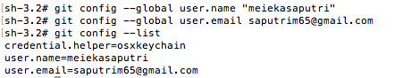

**Mengelola Repo Sendiri di Account Sendiri**

2. Clone repo yaitu proses untuk menduplikasikan remote repo di GitHub ke komputer lokal, dengan menggunakan perintah seperti berikut :
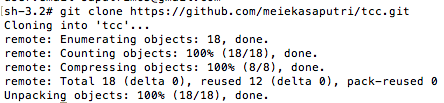

**Mengelola Repo - Mengubah Isi - Push Tanpa Branching dan Merging**

3. Karena sudah clone repo yang dikerjakan waktu prakitikum kemudian pindah ke folder `tcc/minggu-01/` dengan menggunakan perintah cd. Untuk  melihat isi dari file README.md yaitu **# My Awesome Project** menggunakan perintah `cat README.md`sedangkan untuk mengisi atau membuat file dengan menggunakan perintah `vim README.md` klik tombol esc kemudian pilih :wq untuk menyimpan isi file.
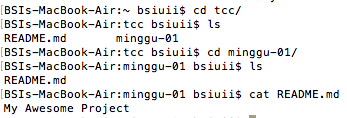
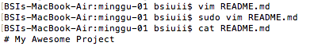

4. Melihat status dari repository lokal menggunakan perintah seperti berikut :
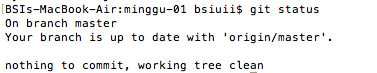

5. Menambahkan file yang ada dengan menggunakan perintah seperti berikut :
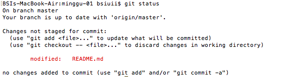

6. Menyimpan perubahan yang dilakukan dan memberikan keterangan tentang perubahan yang dilakukan dengan menggunakan perintah berikut :
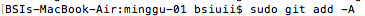
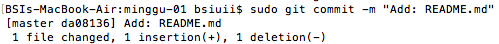

7. Push file ke repository github pada branch master.
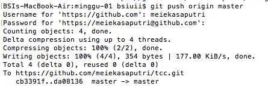

8. Hasil dari push file.
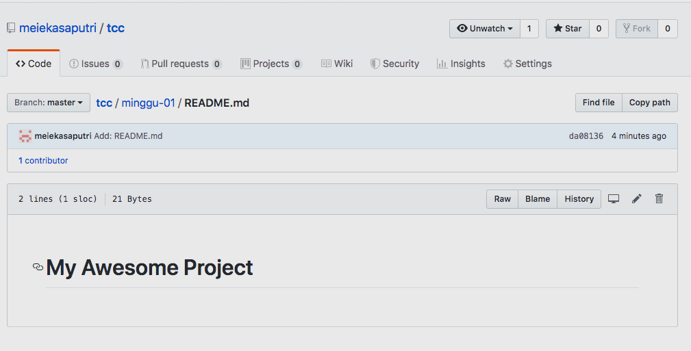

**Mengubah Isi dengan Branching and Merging**

9. Membuat branch baru dengan nama edit-readme-1a dan pindah pada branch tersebut. Kemudian mengedit isi dari file README.md yang sebelumnya menjadi **# My Awesome Project Ini isi proyek mei**. Kemudian file ditambahkan dan dicommit untuk menyimpan perubahan yang dilakukan. Lalu pindah ke branch master dengan perintah `git checkout master`. Kemudian push edit-readme-1a ke github.
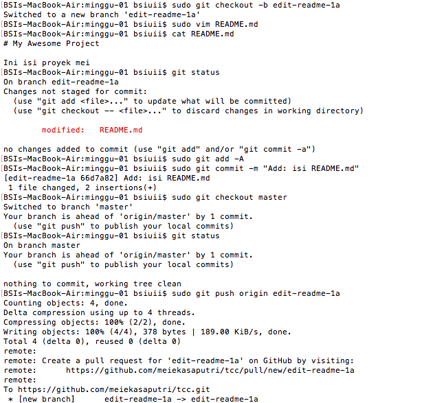

10. Mengirim Pull Request (PR) seperti berikut :.
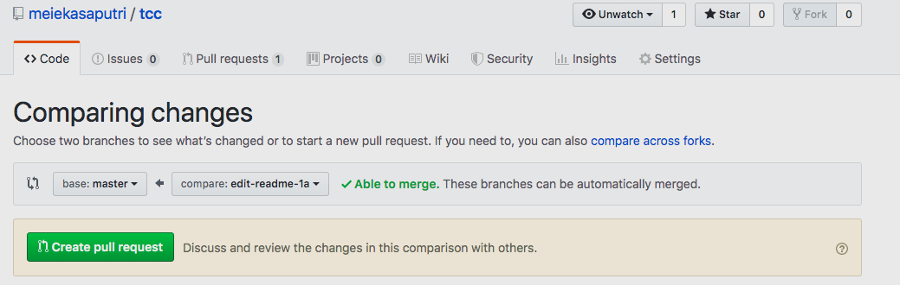
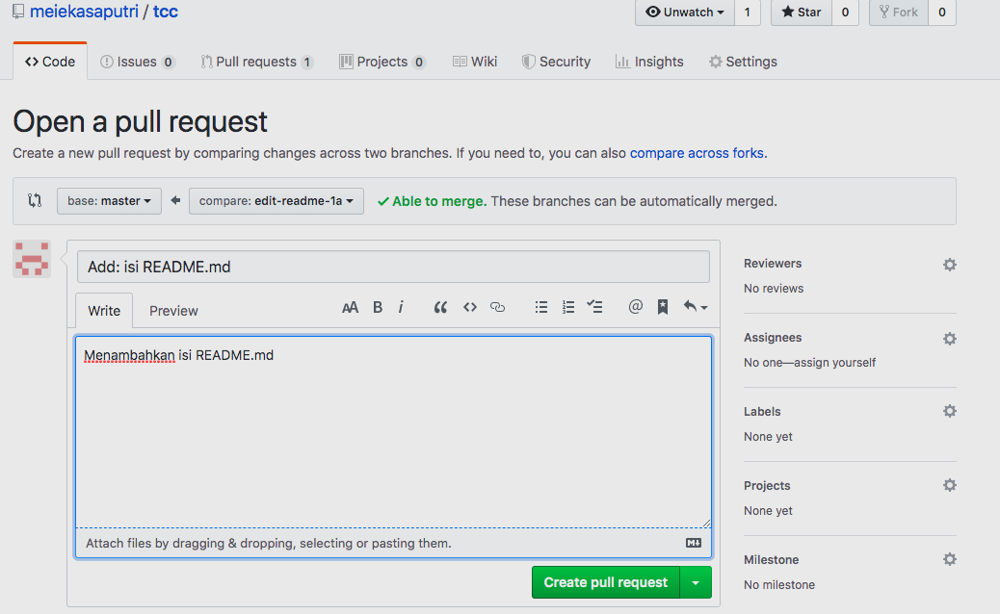

11. Me-merge Pull Request (PR) seperti berikut :
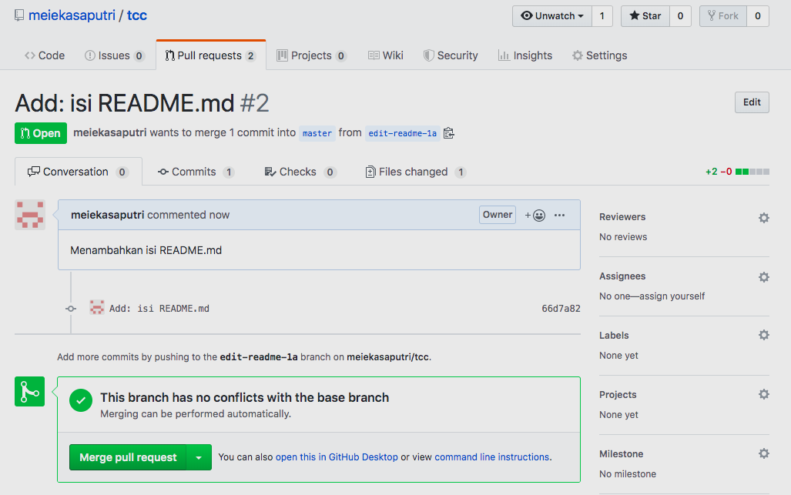

12. `Confirm Merge` branch yang dikirimkan tadi sudah dimasukkan ke branch `master`. Setelah itu, merge di komputer lokal.
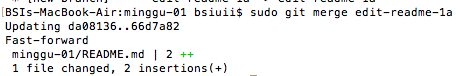

13. Menghapus branch edit-readme-1a menggunakan perintah seprti berikut :
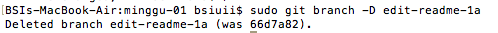

14. Melihat semua branch yang ada dengan perintah seperti berikut :
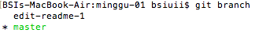

15. Sinkronisasi repo dari github ke komputer lokal menggunakan perintah `git pull`.

