# Laporan Praktikum Pertemuan Minggu ke-02

**Membatalkan Perubahan**

1. Membuat branch baru lalu pindah ke branch baru dengan nama edit-readme-2 tersebut dengan dengan perintah seperti berikut :.
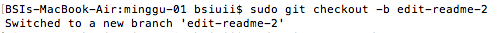

2. Karena sudah clone repo yang dikerjakan waktu prakitikum kemarin maka pindah ke folder `tcc/minggu-01/`dengan menggunakan perintah cd. Untuk mengisi, membuat atau mengedit file dengan menggunakan perintah `vim README.md` di pertemuan kali ini file README.md yang sebelumnya di edit dengan menambahkan kalimat "Jadi agak kacau nih" klik tombol esc kemudian pilih :wq untuk menyimpan isi file. Sedangkan untuk melihat isi dari file README.md yaitu **# My Awesome Project** menggunakan perintah `cat README.md`.
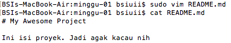

3. Pindah ke branch master dan melihat isi file README.md menggunakan perintah seperti berikut :
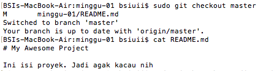

4. Menghapus branch edit-readme-2, lalu mengecek list branch yang ada setelah mengahpus branch. Kemudian melihat isi file README.md untuk memastikan file yang diedit tadi. Melakukan format secara paksa lalu mengecek file README.md setelah di reset dan berubah kembali seperti yang di praktikum sebelumnya. Untuk mengeksekusi perintah-perintah tersebut dengan menggunakan perintah seperti berikut :
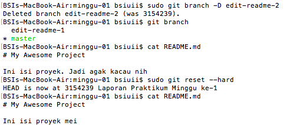

**Undo Commit Terakhir**

5. Melihat log yang telah dilakukan secara oneLine dengan menggunakan perintah berikut :
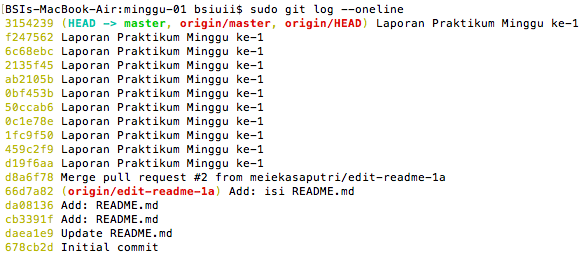

6. Mengedit dan melihat isi file README.md. Lalu menambahkan file yang ada di lokal ke git. Menyimpan perubahan yang dilakukan dan memberikan keterangan tentang perubahan yang dilakukan `Add: contents`. Push file ke repository github pada branch master. Untuk mengeksekusi perintah-perintah tersebut dengan menggunakan perintah seperti berikut :.
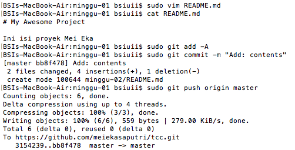

7. Hampir sama dengan nomor 7 hanya isi file README.md yang berbeda setelah di edit.
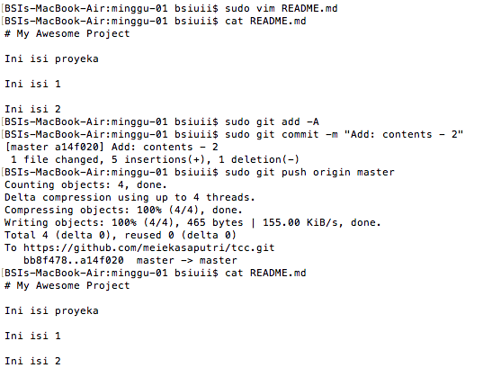

8. Saat `revert HEAD` akan membuka editor. Pada editor tersebut diketikkan pesan revert ( = pesan commit untuk pembatalan). Melihat status dari repository lokal menggunakan perintah seperti berikut :
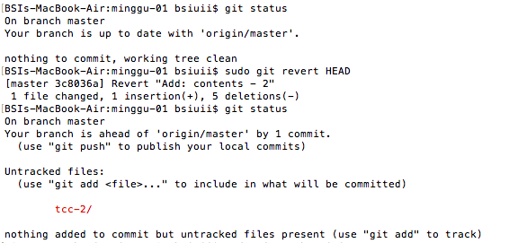

9. Push file ke repository github pada branch master.

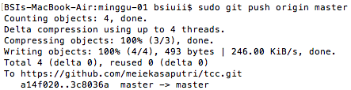

10. Melihat isi file README.md dengan menggunakan perintah seperti berikut :.
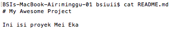

11. Mengedit dan melihat isi file README.md dengan menggunakan perintah seperti berikut :
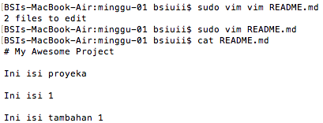

12. Menambahkan file yang ada dengan menggunakan perintah seperti berikut :
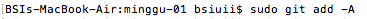

13. Mengedit dan melihat isi file README.md dengan menggunakan perintah seprti berikut :
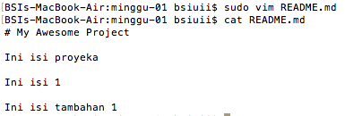

14. Menambahkan file yang ada dan menyimpan perubahan yang dilakukan dan memberikan keterangan tentang perubahan yang dilakukan `Add: isi tambahan 1` dengan menggunakan perintah seprti berikut :
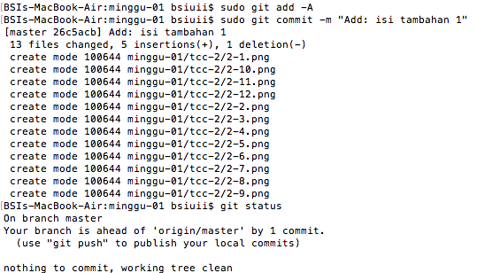

15. Seperti nomor 5 yaitu melihat log yang telah dilakukan secara oneLine dengan menggunakan perintah berikut :
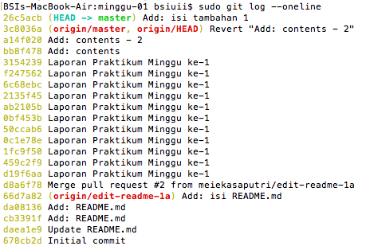

16. Perintah ini digunakan untuk melakukan format secara paksa kemudian melihat hasilnya dengan membuka isi dari file README.md.

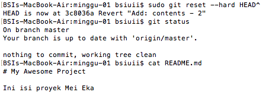

17. Mengedit dan melihat isi file README.md dengan menggunakan perintah seprti berikut :
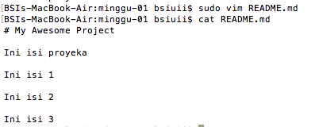

18. Melihat log yang telah dilakukan secara oneLine dengan menggunakan perintah berikut :
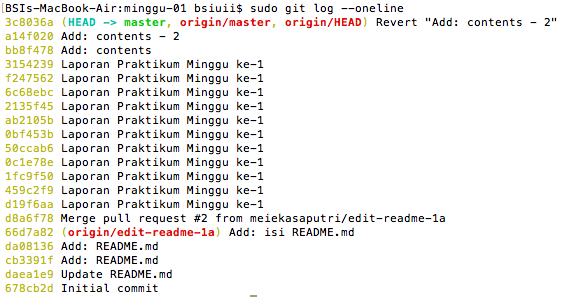

19. Perintah ini digunakan untuk kembali ke perubahan pada saat yang sudah lama, output yang dihasilkan fatal karena a7615fb harusnya disamakan pada saat proses `git log` file mana yang akan dikembalikan
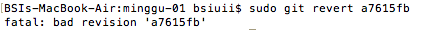

20. Mengedit dan melihat isi file README.md dengan menggunakan perintah seprti berikut :
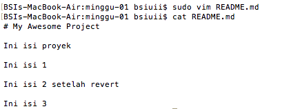

21. Melihat status dari repository lokal menggunakan perintah seperti berikut :
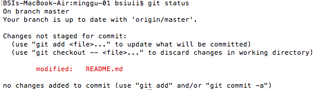

22. Menambahkan README.md ke git lalu melihat status dari repository lokal dan terlihat bahwa README.md telah dilakukan modifikasi.

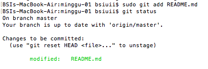

23. Digunakan untuk melanjutkan kembali ke perubahan pada saat yang sudah lama dengan perintah berikut :
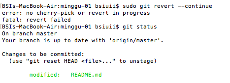

24. Push file ke repository github pada branch master.

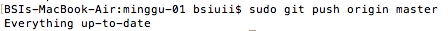
