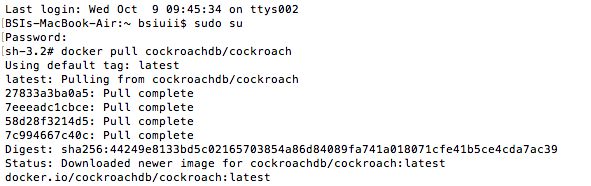
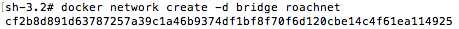
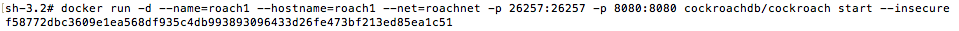
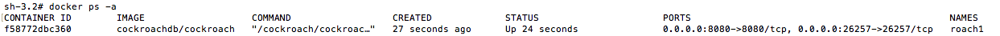
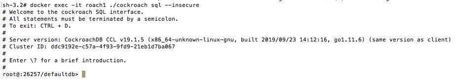
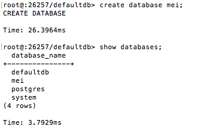
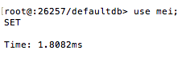
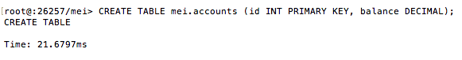
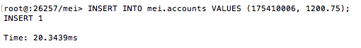
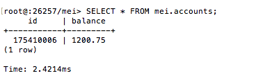

# Laporan Praktikum Pertemuan Minggu ke-05

**Cara Install CockroachDb Menggunakan Docker**

1. Masuk ke Terminal sebagai root. Kemudian jalankan perintah pull image CockroachDb dan tunggu sampai proses selesai.

2. Membuat Bridge Network pada Docker.

3. Menjalankan service CockroachDb.

4. Cek container dan pastikan service sudah up atau running.

5. Test Cluster dengan menggunakan perintah seperti berikut :

6. Membuat dan melihat database dengan nama "mei".

7. Pilih database mei.

8. Membuat tabel dengan nama mei.accounts dengan atribut id sebagai primary key menggunakan tipe data integer dan balance menggunakan tipe data decimal.

9. Memasukkan data ke dalam tabel

10. Melihat isi data dalam tabel dengan menggunakan perintah seperti berikut :

