# Laporan Praktikum Pertemuan Minggu ke-06

**Deploying Your First Docker Container**

1. docker search redis digunakan untuk mencari image redis yang ada di docker hub.

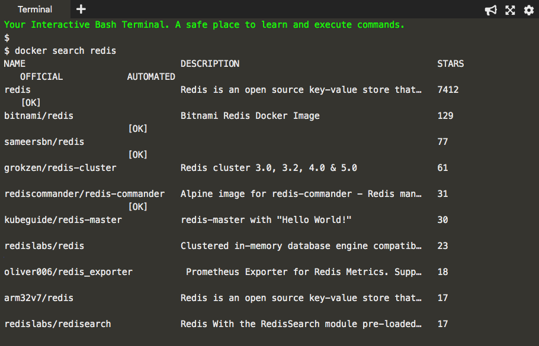
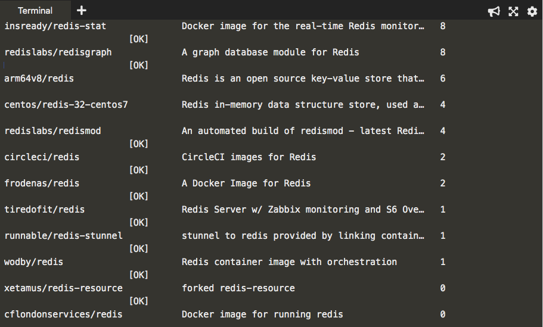

2. docker run -d redis digunakan untuk manjalankan image redis pada background.

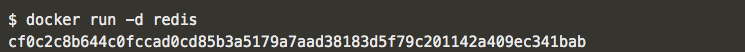

3. docker ps digunakan untuk melihat container yang sudah berjalan.

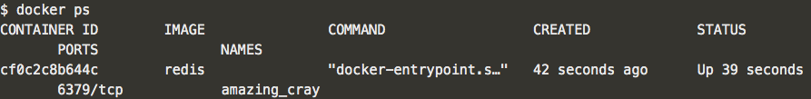

4. docker inspect digunakan untuk melihat detail container.

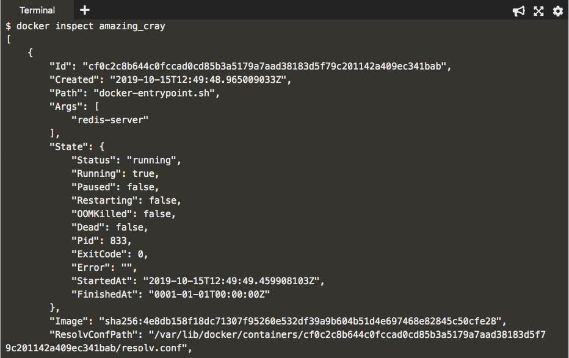

5. docker logs digunakan untuk melihat log message container yang berjalan.

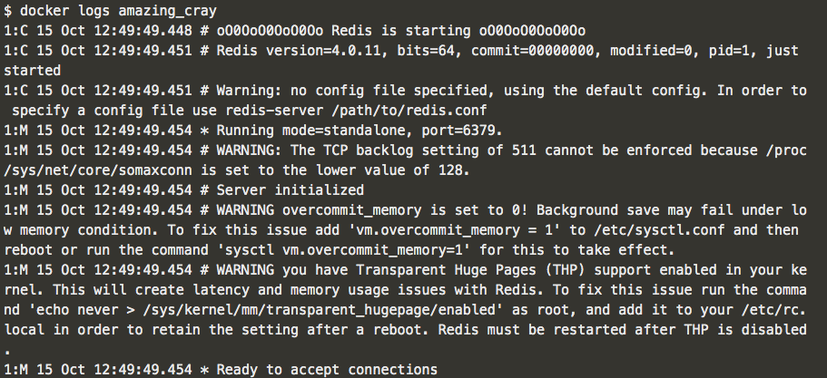

6. docker run -d --name redisHostPort -p 6379:6379 redis:latest digunakan untuk menjalankan container redisHostPort pada background.

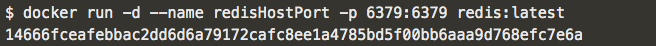

7. docker run -d --name redisDynamic -p 6379 redis:latest digunakan untuk menjalankan container redisDynamic pada background.

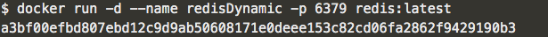

8. docker port redisDynamic 6379 digunakan untuk melihat list mapping port pada container.

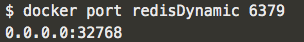
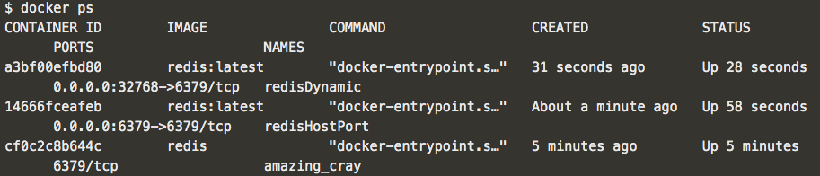

9. docker run -d --name redisMapped -v /opt/docker/data/redis:/data redis digunakan untuk menjalankan image yang disertai dengan persistent volume.

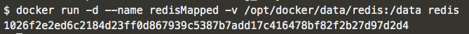

10. docker run ubuntu ps digunakan untuk menjalankan container ubuntu dengan menggunakan comment ps

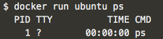

11. docker run -it ubuntu bash digunakan untuk masuk ke dalam container ubuntu

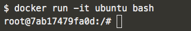

**Deploy Static HTML Website as Container**
1. Membuat Dockerfile, untuk membangun image menyalin konten di bawah ini ke editor.

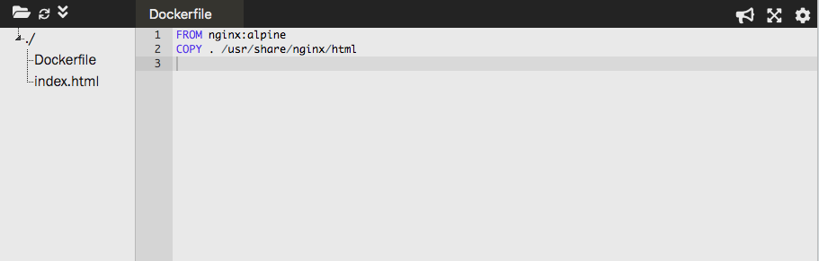

2. docker build -t webserver-image:v1 digunakan untuk membuat image statis HTML.

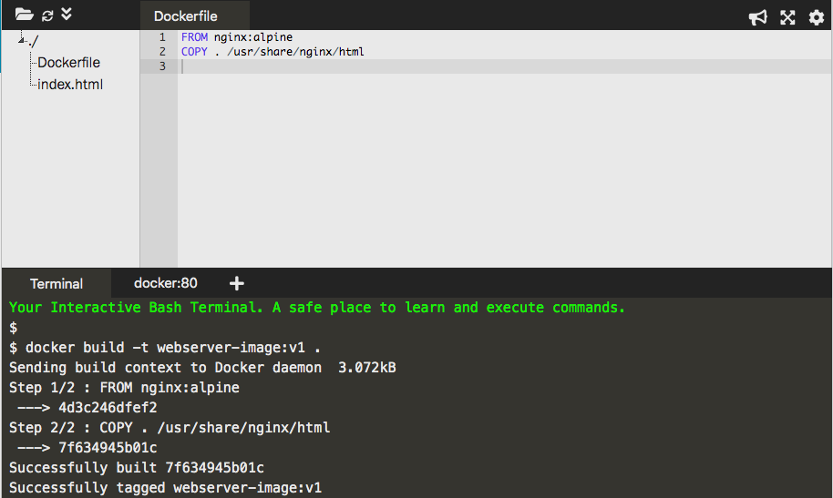

3. docker image digunakan untuk melihat list semua image yang ada di host yang digunakan.

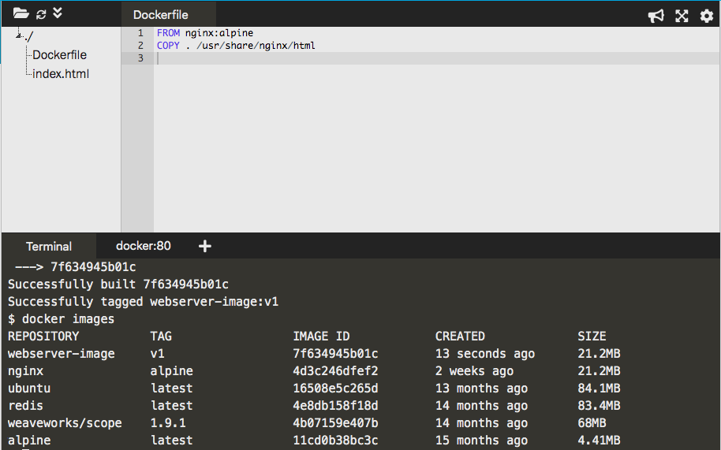

4. docker run -d -p 80:80 webserver-image:v1 digunakan untuk membuat iamge dengan memberikan nama dan tag. Menggunakan port 80 karena web server dan menggunakan parameter -p untuk port.

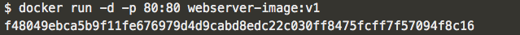

5. Untuk dapat mengakses hasil port 80 melalui curl docker

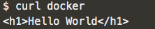

**Building Container Images**

1. Membuat image dasar (base image) dengan menyalin konten di bawah ini ke editor.

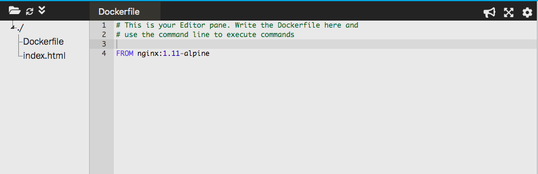

2. Running commands untuk mengcopy index.html ke directory /usr/share/nginx/html/index.html dengan menyalin konten di bawah ini ke editor.

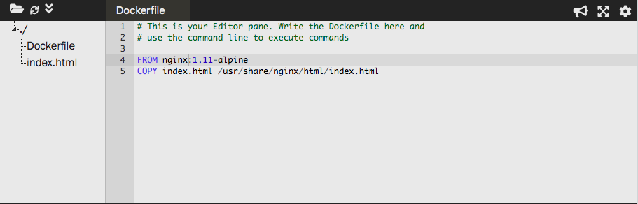

3. Exposing ports dengan menyalin konten di bawah ini ke editor.

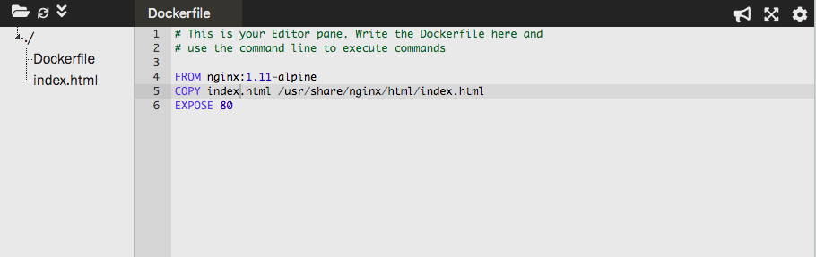

4. Default commands dengan menyalin konten di bawah ini ke editor.

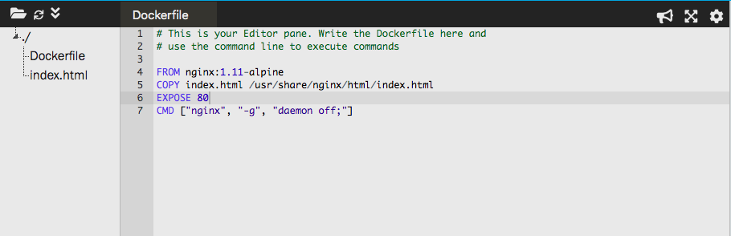

5. docker build digunakan untuk membangun container

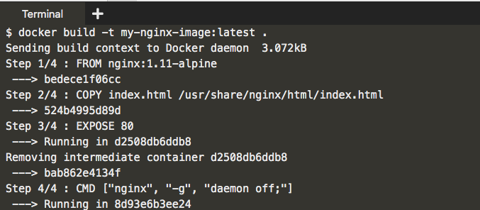

6. docker images digunakan untuk melihat list semua image yang ada di host yang digunakan.

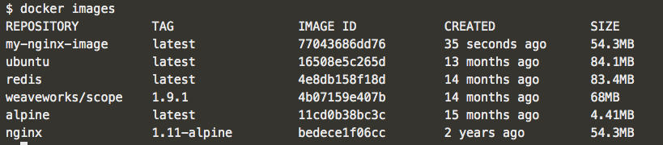

7. docker build -t my-nginx-image:latest digunakan untuk membuat sebuah image dengan nama my-nginx-image:latest dimana image ini dibuild berdasarkan konfigurasi dari file dockerfile.

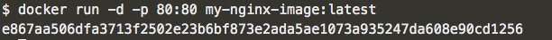

8. docker run -d -p 80:80 my-nginx-image:latest digunakan untuk menjalankan container my-nginx-image:latest pada background dengan menggunakan port 80.

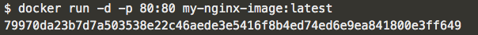

9. Setelah meluncurkan (launch) container, perintah berikut akan mengembalikan file indeks melalui NGINX dan image yang telah dibuat.

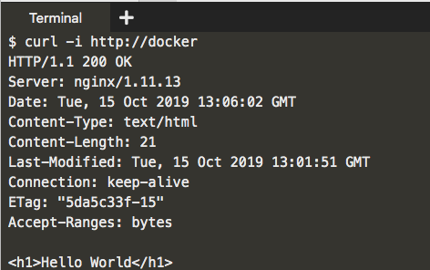

10. docker ps diguanakan untuk melihat containers yang sudah berjalan.
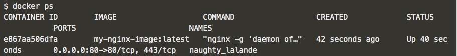
