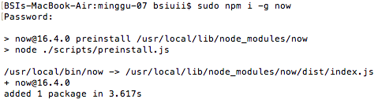
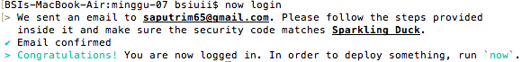
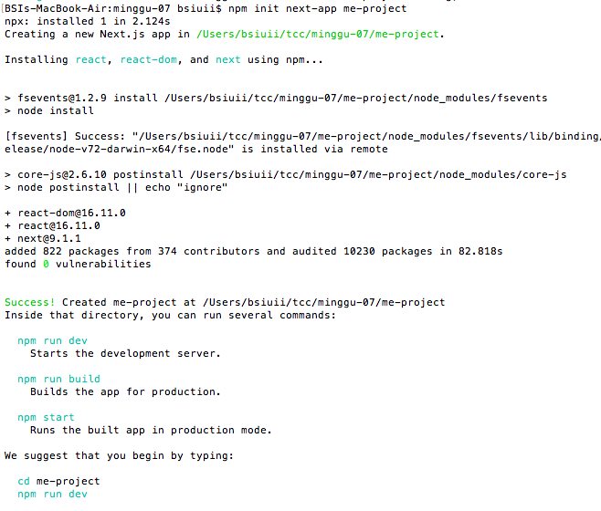
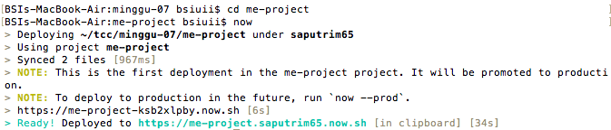
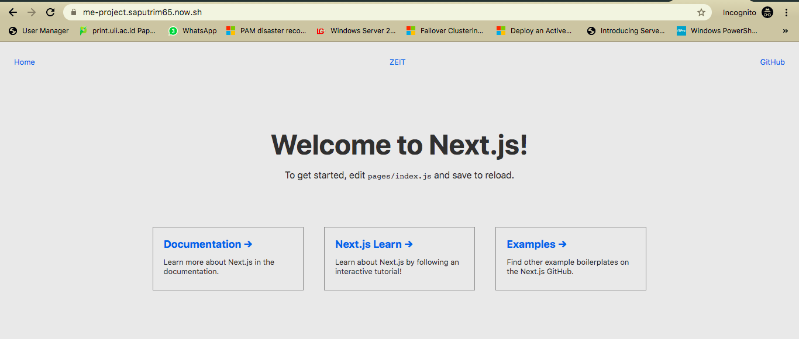

# Laporan Praktikum Pertemuan Minggu ke-07

**Zeit Now**

1. Install Now CLI. Setelah melakukan instalasi node.js, konfigurasi selanjutnya dilakukan di command promt atau bash.

2. Login Now. Maka akan diminta untuk memasukkan email yang sudah terdaftar di Zeit. Verifikasi akan dikirimkan ke email yang dituliskan.

3. Creating a Project and Deploying. Digunakan untuk membuat project dengan nama me-project.

4. Menjalankan Project.

5. Mencoba akses ke https://me-project.saputrim65.now.sh

