# Laporan Praktikum Pertemuan Minggu ke-08

**Dockerized python+flask**

1. Membuat file app.py.

   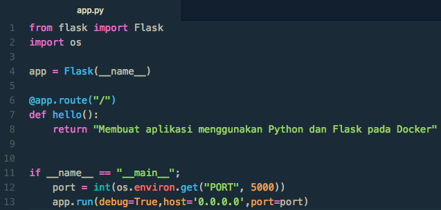

2. Membuat file requirements.txt.
   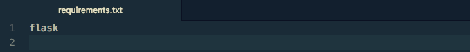

3. Membuat Dockerfile.
   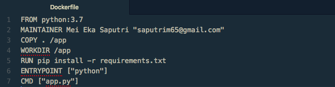

4. Build images docker, dockerhub saya menggunakan ID (050612) dengan perintah berikut :
   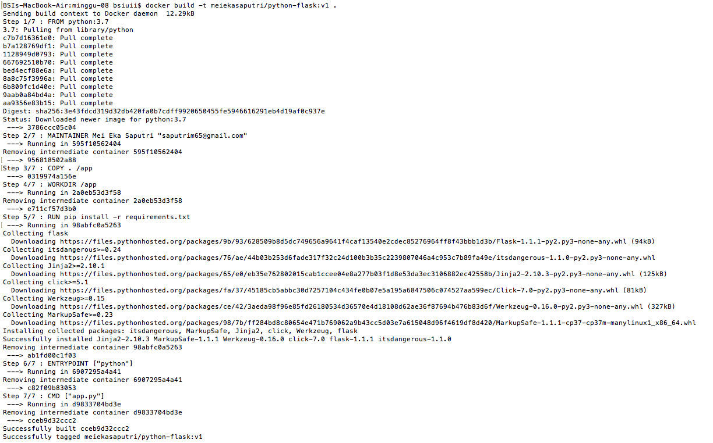

5. Cek images menggunakan perintah docker images.
   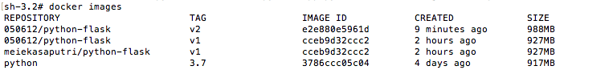

6. Login Docker Hub.
   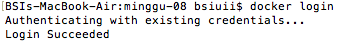

7. Push images ke Docker Hub.
   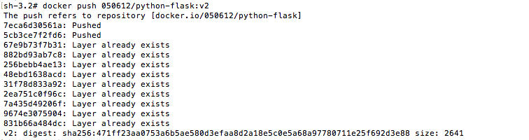

8. Cek images di Docker Hub.
   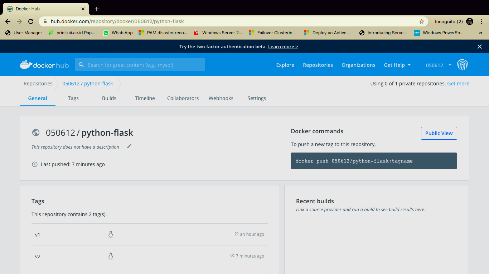

9. Menjalankan images menjadi container dengan menggunakan port 5000.
   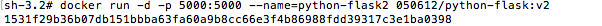

10. Cek Container.
    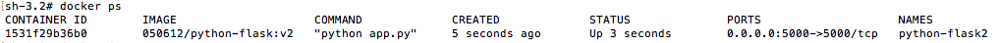

11. Browse app menggunakan URL http://localhost:5000 .
    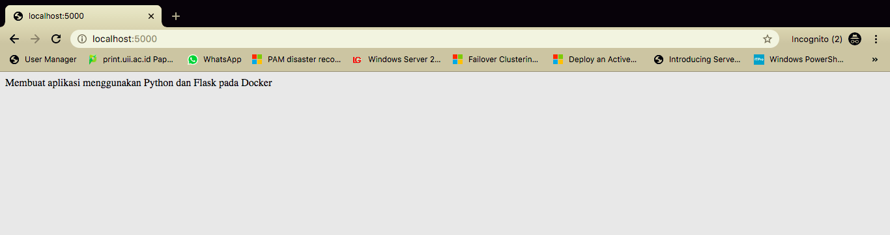
