# Laporan Praktikum Pertemuan Minggu ke-09

  Laporan Minggu ke-09 sudah diselesaikan sebelumnya di Pertemuan Minggu ke-08

# Laporan Praktikum Pertemuan Minggu ke-10

**Git untuk Kolaborasi**

1. Login ke GitHub. Masuk ke repo yang ingin di fork `https://github.com/lindaagustina/tcc`. Kemudian pilih icon Fork.
   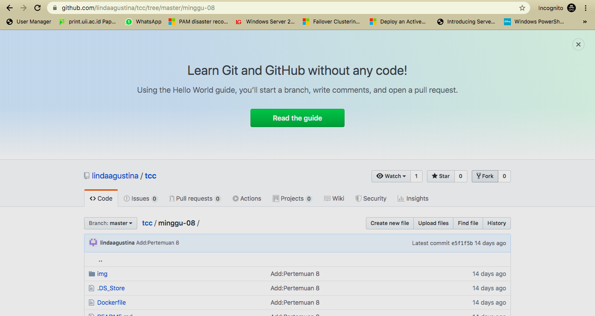

2. Setelah diklik icon Fork maka icon Fork akan berwarna abu-abu seperti ke disable dan akan ada nama github kita
   meiekasaputri/tcc-1 from lindaagustina/tcc.
   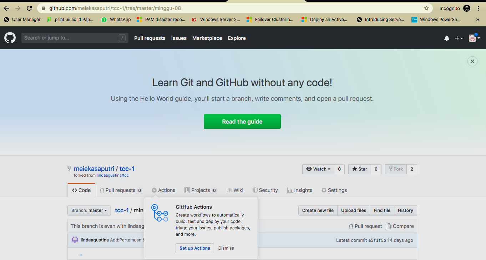

3. Kemudian clone repo yang sudah di fork tadi `git clone https://github.com/meiekasaputri/tcc-1`.
   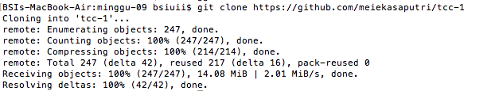

4. Perintah ini digunakan untuk mengecek list yang ada di folder tcc-1.
   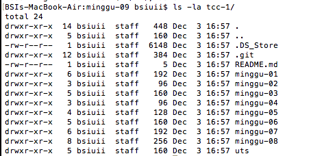

5. Perintah ini digunakan untuk melihat track repository.
   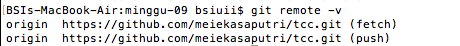

6. Perintah ini digunakan untuk menambahkan remote upstream.
   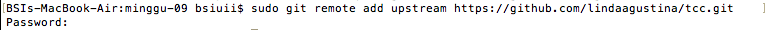

7. Setelah push lihat track repository kembali dengan perintah berikut :
   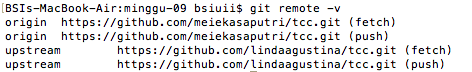

8. Mengedit file README.md yang ada di github lindaagustina.
   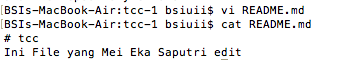

9. Menambahkan semua file yang sudah di edi, untuk melihat apakah sudah berhasil atau belum dengan `git status`.
   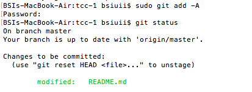

10. Commit dengan memberikan deskripsi @Mei.
   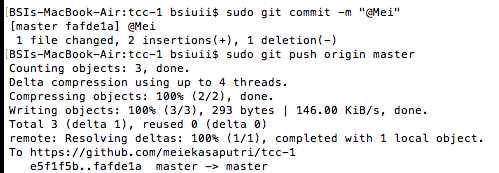

11. New Pull Request.
   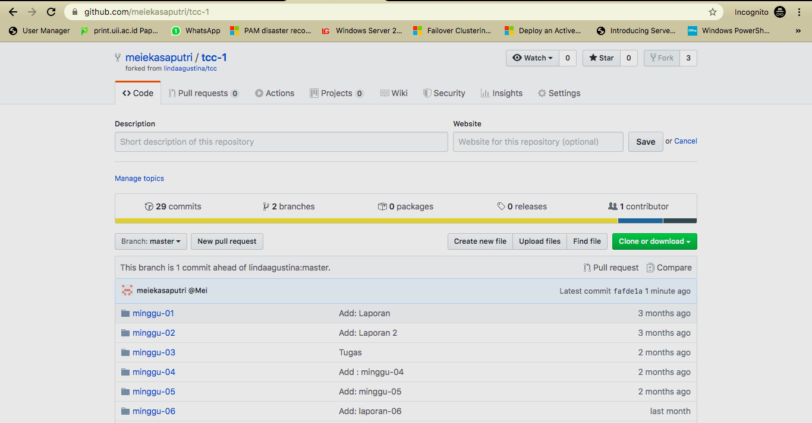

12. Create Pull Request.
   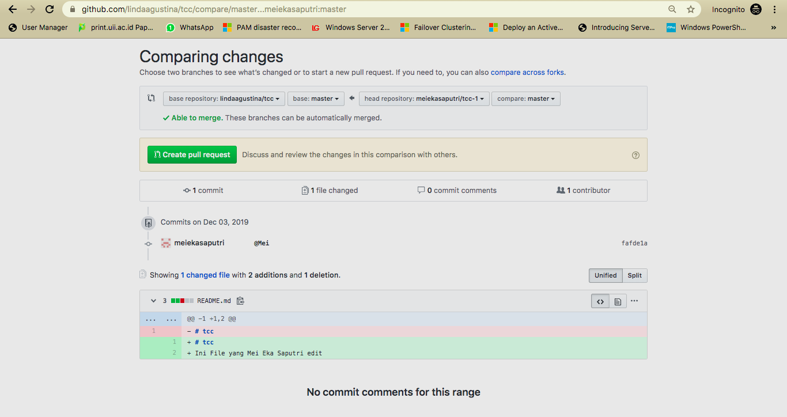

13. Create Pull Request
   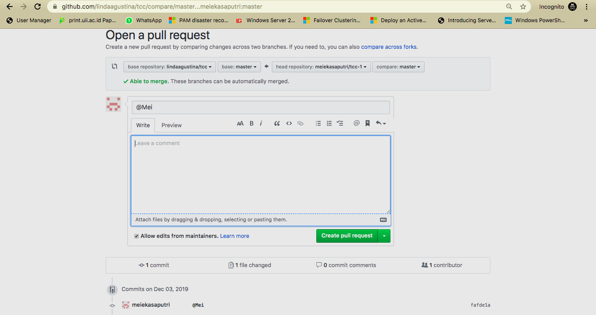

14. Kemudian muncul bahwa saya berkontribusi pada github lindaagustina dan terlihat bahwa tidak ada conflict.
   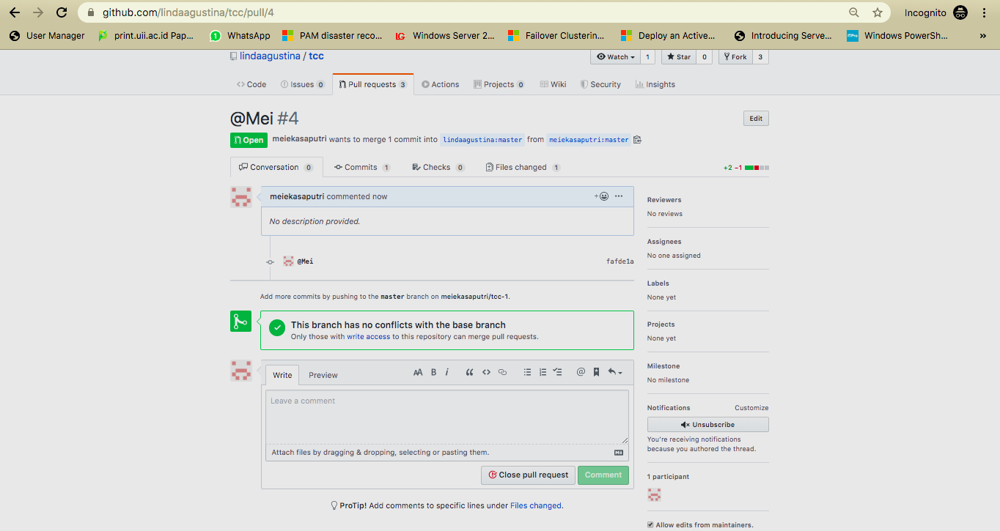
