# Laporan Praktikum Pertemuan Minggu ke-11

**TUGAS KELOMPOK**

Anggota :
- Mei Eka Saputri (175410006)
- Linda Agustina (175410007)
- Nur Alifah (175410008)
- Shafira Khairunnisa Putri (175410009)
- Khanifa Eka Nuryati (175410074)

1.	Konsep IaaS
    Penyedia layanan IaaS memiliki seperangkat infrastruktur yang di colocation atau bekerjasama dengan penyedia fasilitas data center, dimana mereka berlaku sebagai partner vendor dengan keahlian mengelola virtualisasi. Tujuannya adalah untuk memberikan layanan sumber daya atau infrastruktur IT on-demand dengan kapasitas yang tersedia pada seluruh perangkat di infrastruktur IaaS yang berada pada data center tersebut dengan standard yang tinggi.

    Pelanggan dapat memilih sendiri infrastruktur yang akan digunakan melalui website penyedia IaaS yang juga berfungsi sebagai konsol manajemen untuk seluruh elemen IT yang disediakan oleh jasa Cloud IaaS tersebut, seperti penggunaan server dengan modifikasi ram, processor dan berapa server yang akan dipakai, ruangan penyimpanan, aplikasi dan sistem operasi, serta data transfer. Selain itu para provider IaaS juga menyediakan jasa pemeliharaan aplikasi, backup, dan lainnya.

    Pelanggan IaaS membayar sesuai pemakaian “Pay as You Go”, biasanya berdasarkan jam, minggu, atau bulan. Beberapa provider IaaS juga mengenakan biaya berdasar jumlah mesin virtual yang digunakan. Dengan konsep biaya seperti ini maka perusahaan pengguna jasa IaaS tidak perlu melakukan investasi pembelian perangkat server, instalasi, konfigurasi dan manajemen operasional infrastruktur tersebut yang sangat menguras modal terutama untuk sebuah perusahaan startup.

2.	Berbagai Software Iaas
    Infrastructure as a Service adalah penyediaan infrastruktur yang disediakan melalui internet dan dibayarkan berdasarkan pemakaian. Hal ini terjadi apabila developer membutuhkan sebuah infrastruktur dimana dia dapat melakukan setting untuk jalannya sebuah aplikasi. IaaS memberikan kendali penuh bagi pengguna layanan untuk menyewa infrastruktur IT (storage, RAM, prosesor dll) secara virtual tanpa sistem operasi, yang tentunya pemilihan sistem operasi tersebut dipilih berdasarkan keinginan pengguna. Apabila SaaS dan PaaS kurang terasa manfaatnya bagi perusahaan, IaaS ini sangat menguntungkan bagi perusahaan kecil yang membutuhkan sebuah infrastruktur IT tanpa harus membeli perangkat yang dibutuhkan tersebut.

    Contoh:

    a. Cisco

       Cisco menyediakan semua basic fitur yang dibutuhkan dalam solusi bisnis telepon. Pengguna dapat secar mudah mengatur musik dan pesan untuk pelanggan selagi dalam keadaan tunggu. Pengguna juga memiliki pilihan untuk membuat voicmail recording dan frekuensi dapat diubah.
       Pro:
       Sistem telepon bisnis kecil ini memberikan berbagai alat komputer terpadu, termasuk instant messaging kemampuan dan video. Hal ini juga menyediakan banyak fitur paging dasar dan lanjutan.
       Cons:
       Layanan ini hanya menyediakan garansi satu tahun pada produk-produknya.

       http://www.toptenreviews.com/business/phones/best-small-business-phone-systems/cisco-review/.

 
   b. Biznet GIO.
      Biznet GIO Cloud adalah layanan yang dirancang khusus bagi korporasi, yang menawarkan tingkat keandalan, keamanan dan pemenuhan compliance paling tinggi. Layanan ini memberikan penggunanya kemampuan manajemen penuh terhadapa server-server yang ada. Layaknya pusat data virtual, Biznet GIO Enterprise Cloud dilengkapi dengan server-server hypervisor fisik dan server untuk tuntunan manajemen virtualisasi aplikasi- aplikasi milik pengguna.

   c. Amazon EC2.
      Amazon Elastic Compute Cloud (EC2) membentuk bagian tengah dari Amazon.com 's cloud computing platform Amazon Web Services (AWS), dengan memungkinkan pengguna untuk menyewa komputer virtual yang yang menjalankan sendiri aplikasi komputer . EC2 mendorong scalable penyebaran aplikasi dengan menyediakan layanan web di mana pengguna dapat boot Amazon Mesin Gambar untuk mengkonfigurasi mesin virtual , yang Amazon menyebut sebuah "contoh" , yang berisi perangkat lunak yang diinginkan. Seorang pengguna dapat membuat, peluncuran, dan mengakhiri Server -instances yang diperlukan, membayar per jam untuk server aktif - maka istilah "elastis". EC2 menyediakan pengguna dengan kontrol atas lokasi geografis dari contoh yang memungkinkan untuk latency optimasi dan tingkat tinggi redundansi.

3.	Getting started software IaaS yang dipilih (Opennebula)
    Getting Started with Opennebula
    a. Login ke Opennebula dashboard.
       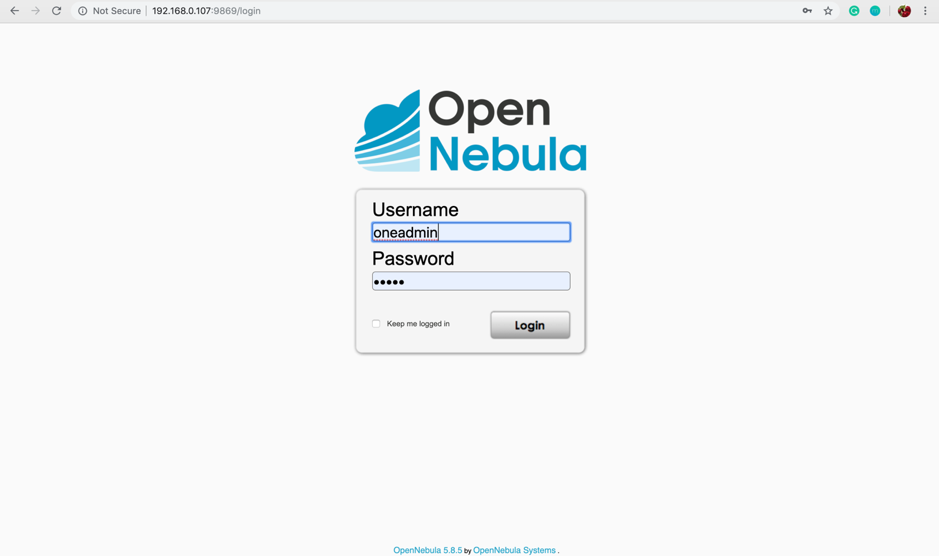
    b. Kemudian klik Instances - VMs.
       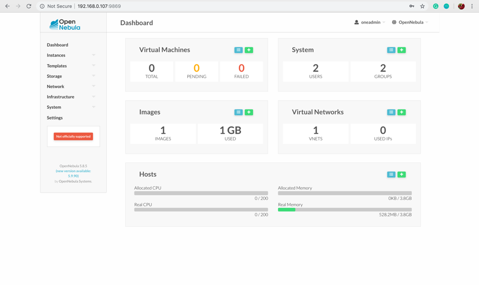
    c. Klik + untuk membuat mesin virtual baru.
       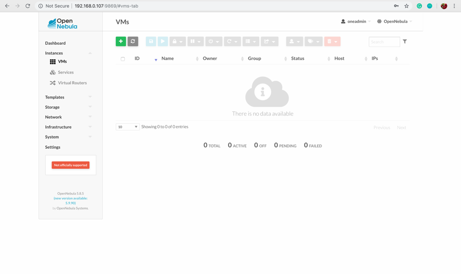
    d. Pilih template yang akan digunakan, kemudian isi nama mesin virtual dan spesifisikasi yang akan digunakan, lalu
       klik Create.
       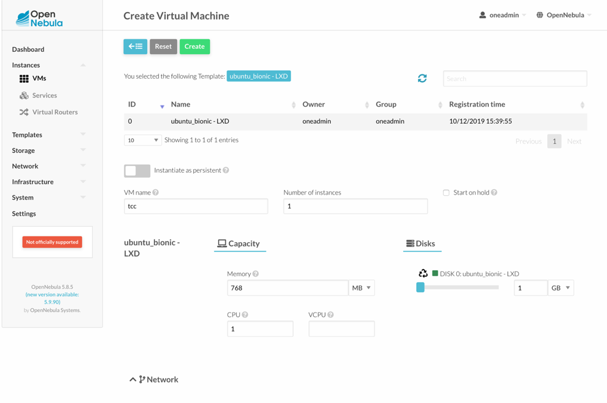
       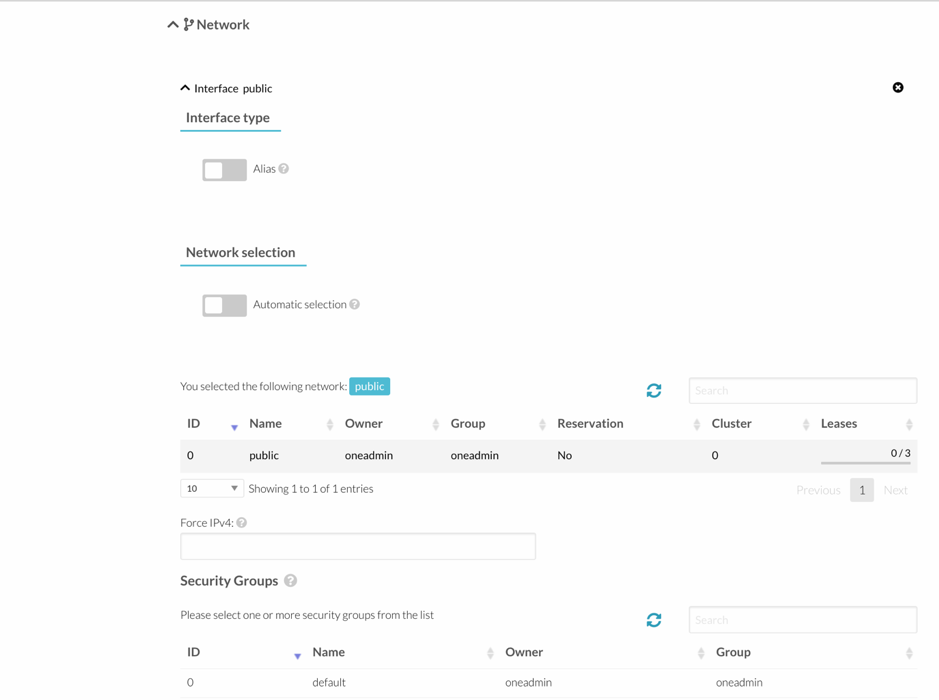
       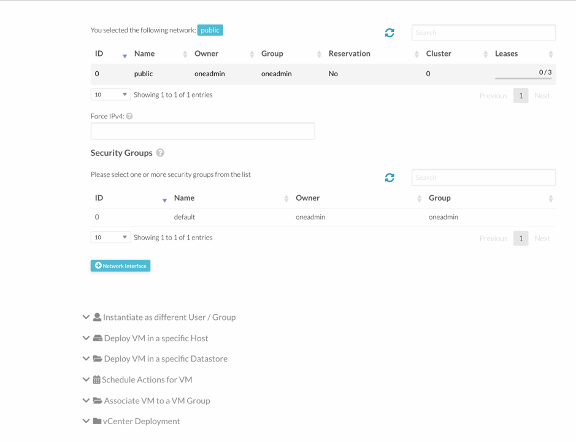
    e. Mesin virtual berhasil dibuat, untuk melihat detail klik pada nama mesin virtual.
       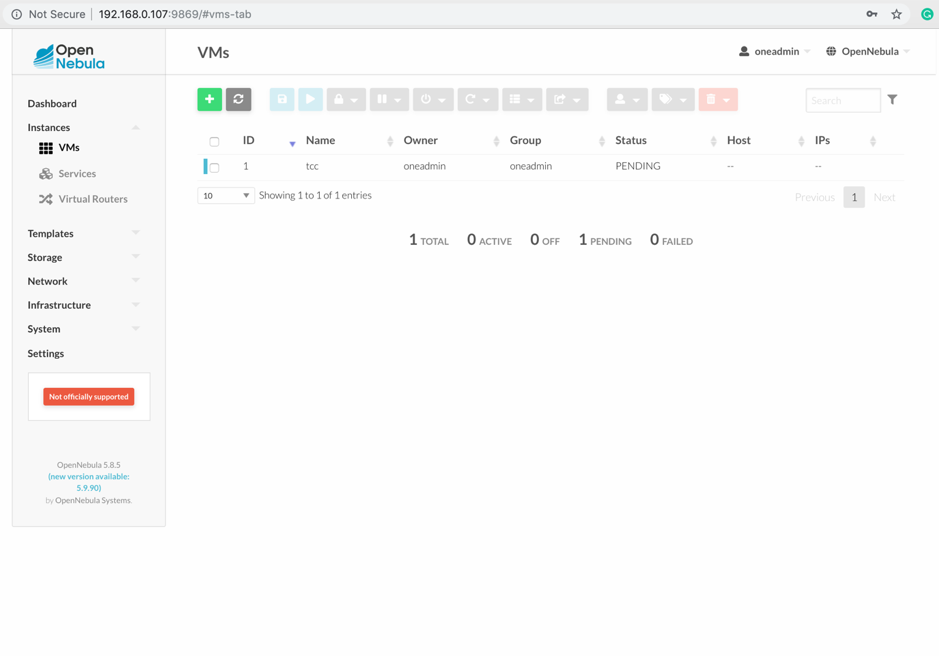
    f. Untuk melihat log, klik Log. Jika log berstatus RUNNING, maka mesin virtual sudah siap digunakan.
       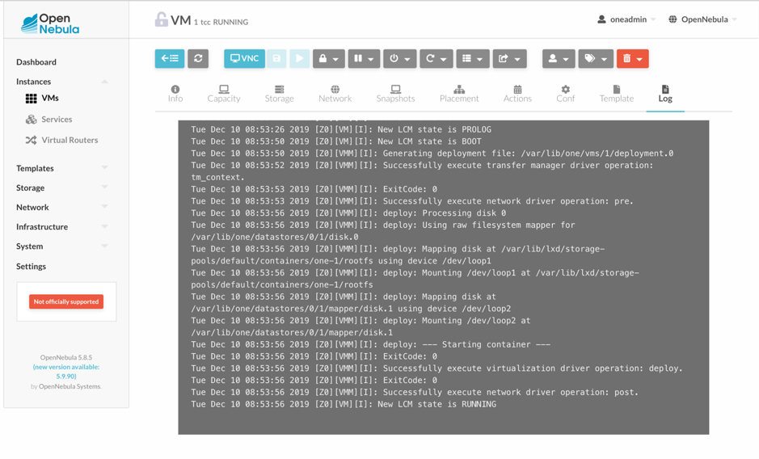
    g. Untuk mengakses console, klik VNC.
       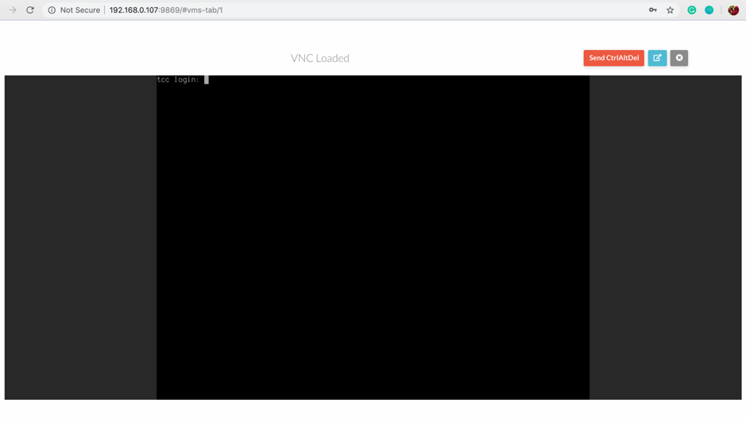

4.	Arsitektur dan konsep deployment pada software IaaS yg dipilih (Opennebula)
    OpenNebula adalah komputasi awan toolkit untuk mengelola heterogen didistribusikan data center infrastruktur. OpenNebula toolkit mengelola infrastruktur virtual data center untuk membangun implementasi swasta, publik dan hibrida infrastruktur sebagai layanan . OpenNebula adalah  perangkat lunak open source dan bebas , tunduk pada persyaratan dari Apache License versi 2.

    Arsitektur
    Software openNebula memenuhi standar untuk membangun sebuah infrastruktur cloud computing. OpenNebula adalah toolkit yang handal dan mudah dalam membangun infrastruktur cloud computing sebagai service cloud. Open Nebula mempunyai arsitektur yang bersifat flexible, komponen dan interface sesuai dengan kondisi data center dimanapun. Open nebula menyediakan interface cloud infrastruktur hybrid dan private.

    OpenNebula orchestrates storage, jaringan, virtualisasi, pemantauan, dan keamanan  teknologi untuk menggelar layanan multi-tier (misalnya cluster menghitung ) sebagai mesin virtual pada infrastruktur didistribusikan, menggabungkan kedua sumber daya pusat data dan sumber daya terpencil awan, sesuai dengan kebijakan alokasi. Menurut Komisi Eropa 2010 laporan “… hanya sedikit awan didedikasikan proyek penelitian dalam arti luas telah dimulai – yang paling menonjol di antara mereka mungkin OpenNebula …”

    Antarmuka OpenNebula dibagi dalam empat kategori yaitu
     a. Antarmuka cloud untuk Cloud Customer
        Misalnya menggunakan Sunstone cloud user yang sederhana.
     b. Antarmuka tingkat Administrator untuk Cloud Advanced Userd dan Operator.
        Misalnya menggunakan CLI (Command Line Interface) dan Sunstone GUI yang canggih
     c.	API (Application Programming Interface) untuk para Cloud Integrator
        Misal menggunakan bahsa pemrograman Ruby, Java dan XMLRPC API
     d.	Appliance Builders
        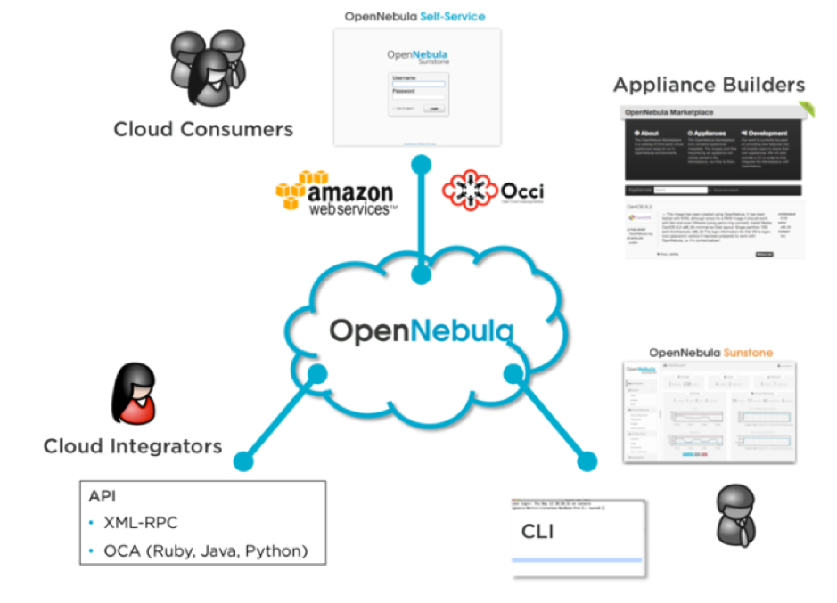

    Kemudian yang ditawarkan OpenNebula adalah
     a. Image Catalog
        Merupakan storage yang merupakan image dari Virtual Machine yang sedang berjalan.
     b.	Network Catalog
        Merupakan catalog dari virtual-virtual network yang sedang berjalan
     c.	Template catalog
        Merupakan semacam template seperti operating system template yang kita bisa instal dalam hitungan detik
     d.	Pengontrolan Resources yang canggih
        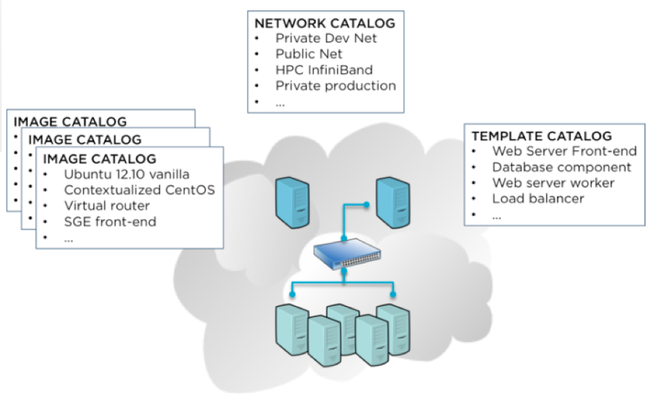
        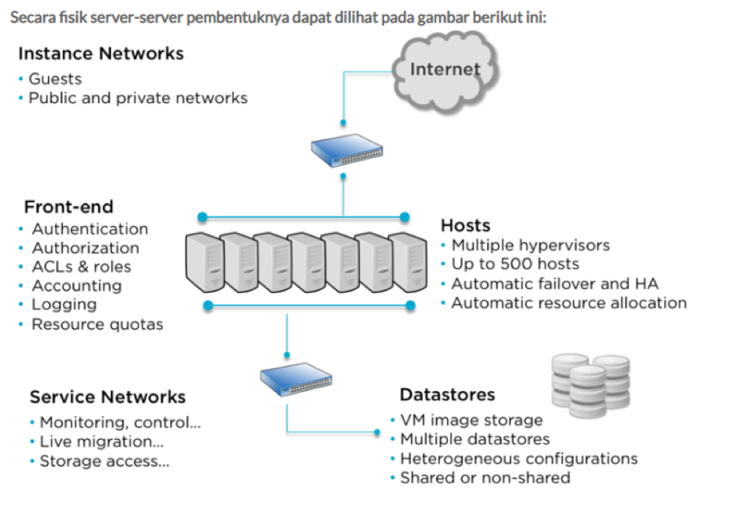

    Konsep OpenNebula ini menawarkan kesederhanaan dalam memberikan solusi yang lengkap untuk membuat dan melakukan manajemen virtualisasi data center dalam tingkat enterprise. Dengan  menggunakan OpenNebula bisa  diimplementasikan  server private  cloud  computing dengan  virtualisasi sehingga membuat mesin virtualisasi server pada worker -node dan dengan  menggunakan OpenNebula proses  pengelolaan image dan pendeployan mesin virtual  dapat diatur dengan mudah dari front- node baik dengan command line interface maupun dari sunstone web interface.

    Pada hal ini OpenNebula berjalan di atas sistem operasi ubuntu bionic yang di virtual kan melalui software Vmware, yang mempunyai 2 sistem operasi yaitu Frontend Server dan Node Server. Dimana frontend ini bertitik pusat pada kinerja interface dari opennebula dan node bekerja sebagai sistem atau host yang di gunakan dalam menjalankan hak akses penuh untuk memanfaatkan opennebula salah satunya dalam menjalankan suatu (virtual machine) vm pada opennebula ini . pada penginstalan vm yang di buat ini mempunyai 3 unsur sebelum vm terbuat yaitu virtual network , host dan images yang dimana wadah untuk menyatukan 3 unsur tersebut bernama templates.
