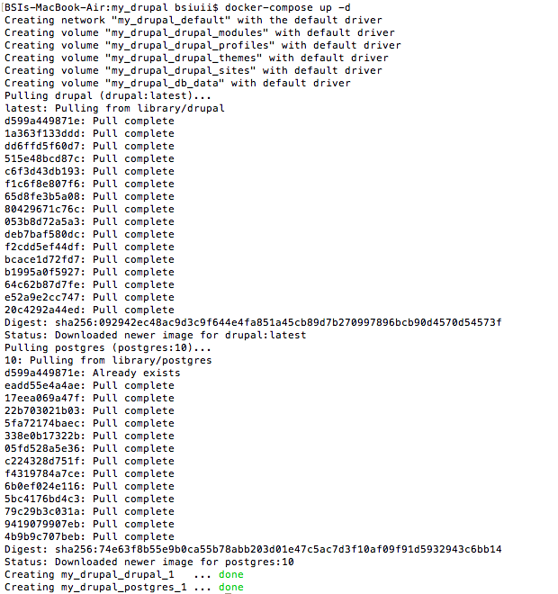

# Laporan Praktikum Pertemuan Minggu ke-12

**Instalasi Drupal Menggunakan Docker Compose**

1. Membuat direktori my_drupal di dalam directory minggu-12, kemudian pindah ke directory my_drupal tersebut.
   

2. Membuat file docker-compose.yml menggunakan perintah vi.
   Di dalam file tersebut membuat 2 container yaitu drupal dengan menggunakan image drupal:latest dan postgres dengan menggunakan image postgres:10.
   Dimana drupal dapat diakses menggunakan port 8088 dan drupal menggunakan port 5432.
   Terdapat volumes yang digunakan agar file yang ada dalam directory tersebut tidak hilang saat container melakukan restart.
   Terdapat environment untuk mendefinisikan password dari postgres.
   

3. Perintah berikut digunakan untuk menjalankan file docker-compose.yml,
   -d digunakan agar proses berjalan pada background.
   

4. Perintah berikut digunakan untuk melihat container yang sudah ada.
   

5. Kemudian akses drupal dengan akses URL http://127.0.0.1:8088 untuk proses instalasi.
   Pilih bahasa yang digunakan yaitu English.
   

6. Memilih Profil instalasi yaitu standar.
   

7. Konfigurasi Database dengan mengisi field sesuai dengan yang ada pada file docker-compose.yml.
   
   

8. Prose instalasi sedang berjalan.
   

9. Konfigurasi Site.
   
   

10. Proses instalasi selesai, kemudian muncul tampilan awal drupal.
   
