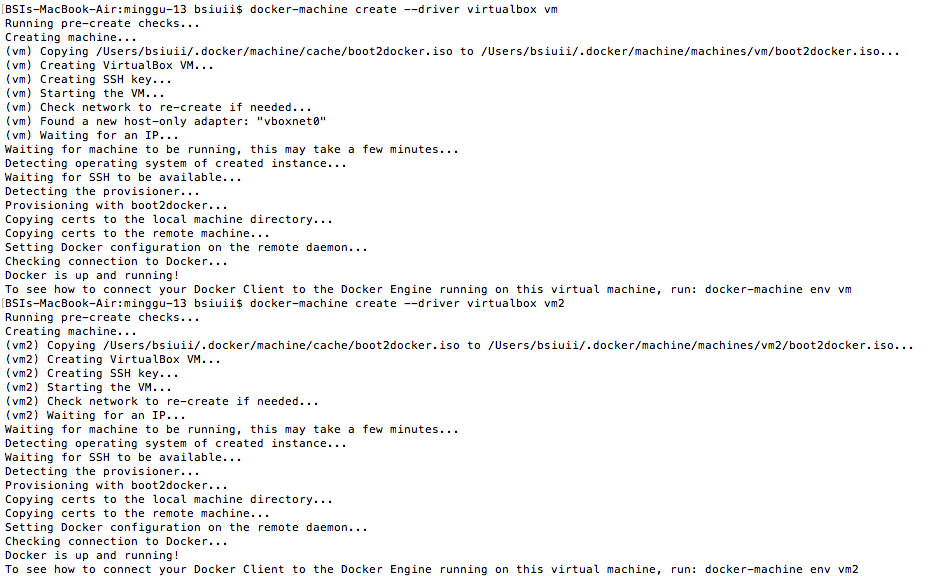
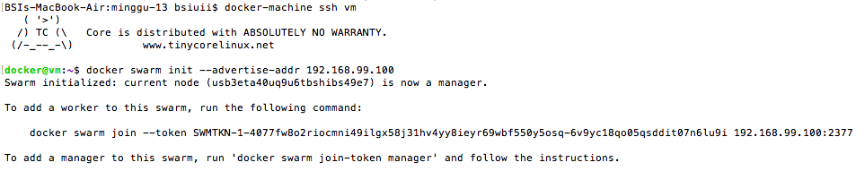
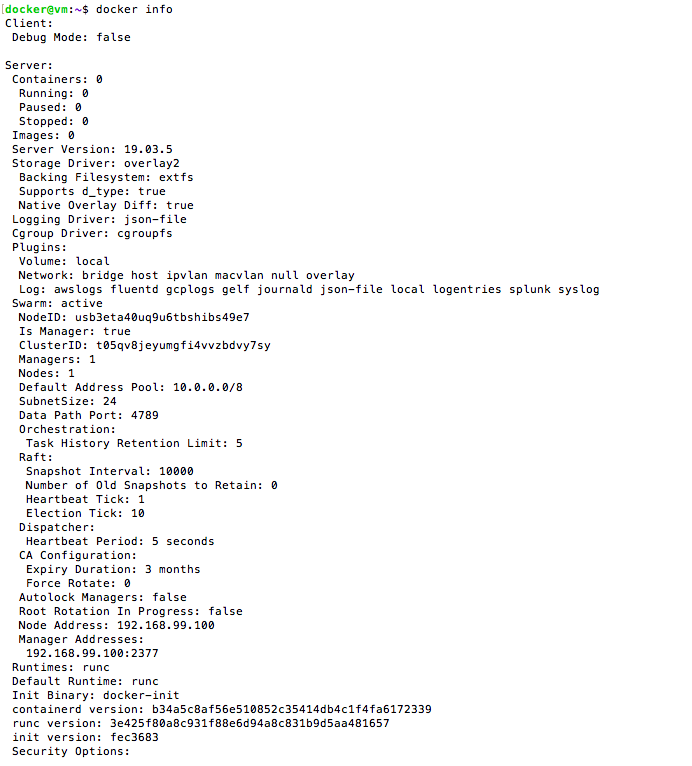
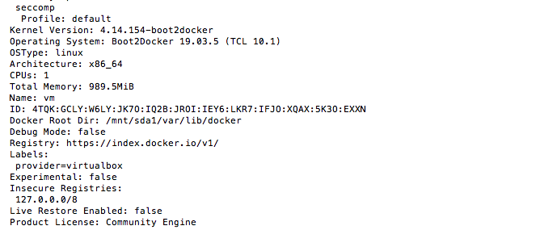
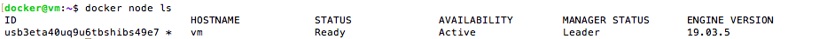
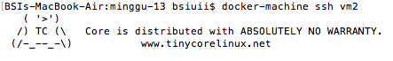
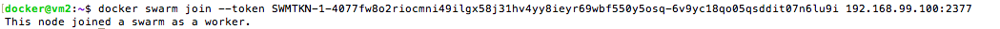
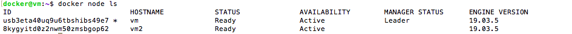

# Laporan Praktikum Pertemuan Minggu ke-12

**Docker Swarm**

1. Membuat Virtual Machines (VMs) dengan nama vm dan vm2 menggunakan  perintah seperti berikut.
   

2. Menjadikan vm sebagai swarm manager dengan cara ssh ke mesin vm kemudian menjalankan perintah sebagai berikut.
   

3. Melihat status pada swarm dengan menggunakan perintah `docker info`.
   
   

4. Melihat informasi tentang node dengan menggunakan perintah `docker node ls`.
   

5. Melakukan ssh ke mesin vm2.

   

6. Join mesin vm2 ke swarm mesin vm dengan perintah seperti berikut.
   

7. Masuk ke mesin vm untuk melihat node yang sudah join ke swarm, kemudian jalankan perintah docker node ls.
   
