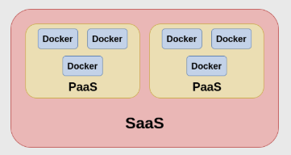
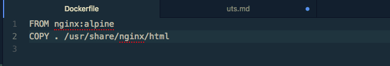
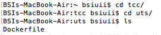
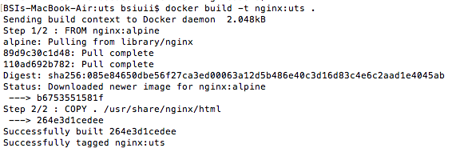
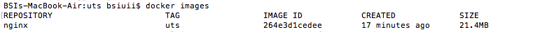
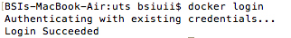
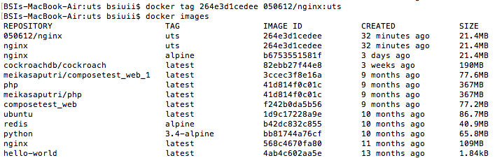
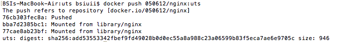
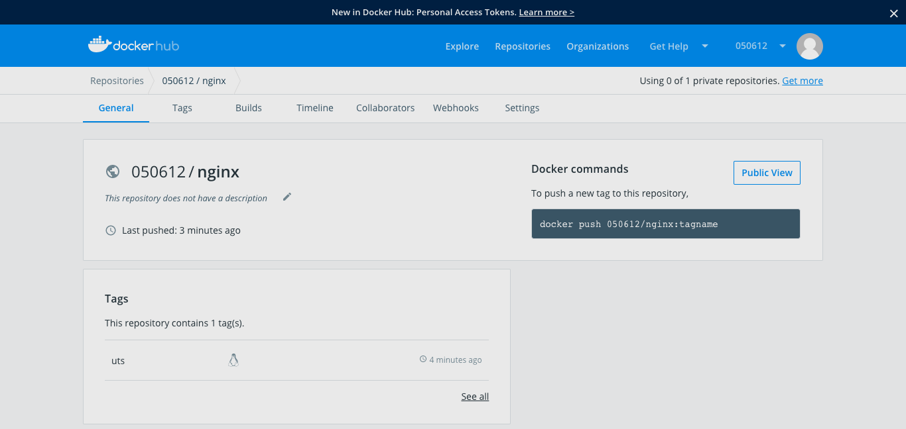

# UTS

**Pengertian Docker**
Docker adalah sebuah proyek yang bersifat open source dibawah lisensi Apache Versi 2.0 yang bisa dipergunakan secara gratis oleh developer dan berfungsi sebagai wadah atau container untuk memasukkan sebuah aplikasi secara lengkap beserta semua hal lainnya yang dibutuhkan sehingga dapat berjalan dimana saja.
Dalam hal ini, developer atau sysadmin dapat menjalankan aplikasi di mana pun misalnya di laptop, data center, virtual machine dan cloud.
Docker adalah salah satu platform yang dibangun berdasarkan teknologi container.
Docker merupakan sebuah project open-source yang menyediakan platform terbuka untuk developer maupun sysadmin untuk dapat membangun, mengemas, dan menjalankan aplikasi dimanapun sebagai sebuah wadah (container) yang ringan.

**Pengertian PaaS**

Platform as a service (PaaS) adalah kategori layanan komputasi cloud yang menyediakan platform yang memungkinkan pelanggan untuk mengembangkan, menjalankan, dan mengelola aplikasi tanpa kompleksitas membangun dan memelihara infrastruktur yang biasanya terkait dengan pengembangan dan peluncuran aplikasi.
PaaS dapat disampaikan dalam dua cara :
sebagai publik layanan cloud dari penyedia, di mana konsumen kontrol penyebaran perangkat lunak dengan sedikit pilihan konfigurasi, dan provider yang menyediakan jaringan, server, penyimpanan, OS, 'middleware' (yaitu; java runtime, .net runtime, integrasi, dll.), database dan layanan lainnya untuk menjadi tuan rumah konsumen aplikasi,
atau sebagai layanan pribadi (perangkat lunak atau alat) di dalam firewall, atau sebagai perangkat lunak yang digunakan pada public infrastructure as a service.

**Pengertian SaaS**

SaaS (software as a service atau perangkat lunak berbentuk layanan) adalah suatu model penyampaian aplikasi perangkat lunak oleh suatu vendor perangkat lunak yang mengembangkan aplikasi web yang diinangi dan dioperasikan (baik secara mandiri maupun melalui pihak ketiga) untuk digunakan oleh pelanggannya melalui Internet.
Pelanggan tidak mengeluarkan uang untuk memiliki perangkat lunak tersebut melainkan hanya untuk menggunakan. Pelanggan menggunakan perangkat lunak tersebut melalui antarmuka pemrograman aplikasi yang dapat diakses melalui web dan seringkali ditulis menggunakan layanan web atau REST.

**Keterkaitan antara Docker, PaaS, dan SaaS**

Docker dapat mendukung konsep PaaS, yg mana PaaS sendiri dapat menjadi bagian dari SaaS.

# Docker Hub
**Upload Images to Docker Hub**

1. Masuk ke directory uts yang ada di dalam directory tcc. Kemudian membuat file Dockerfile yang menggunakan base images nginx:alpine di dalam directory uts tersebut.

   
   

2. Membuat images nginx menggunakan Dockerfile yang sebelumnya sudah dibuat dengan menggunakan perintah docker build -t nama images:tag (nginx:uts) . dimana titik(.) digunakan untuk mendeklarasikan bahwa Dockerfile yang akan digunakan terdapat pada drectory tersebut.
   

3. docker images digunakan untuk melihat hasil docker images yang telah berhasil dibuat.
   

4. Sebelum mengupload docker images ke docker hub pastikan sudah login ke docker hub terlebih dahulu dengan menggunakan perintah docker login dengan memasukkan user ID dan password docker hub.
   

5. docker images yang akan dipush ke docker hub harus diganti nama images nya menggunakan 050612/nginx:uts, dimana 050612 adalah nama user ID docker hub sedangkan nginx merupakan nama aplikasinya, dan uts merupakan nama tag nya. Penggunaan user ID agar saat images di push akan tertuju ke docker hub kita.
   

6. Upload docker images yang sudah diganti tagging nya menggunakan perintah docker push 050612/nginx:uts.
   

7. Jika sudah berhasil dipush maka akan muncul images yang telah dipush pada docker hub.
   Dimana dockerfile images nginx yang sudah dipush ke dockerhub dapat diakses di URL berikut : https://cloud.docker.com/u/050612/repository/docker/050612/nginx .
   Docker images adalah sebuah template yang bersifat read only. Template ini sebenarnya adalah sebuah OS yang telah diinstall berbagai aplikasi. Docker images berfungsi untuk membuat docker container, menggunakan 1 docker images kita dapat membuat banyak docker container.
   
